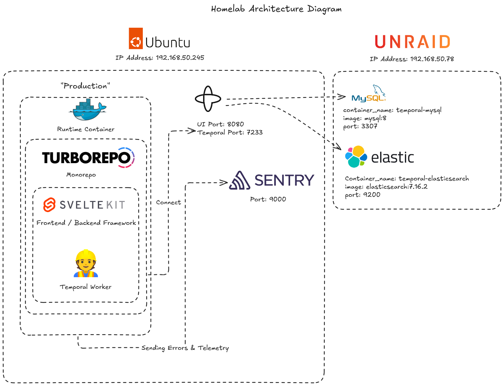

# homelab
My own personal homelab

## Diagram

## Tip & Tricks

>How come I'm can't access my reverse proxy?

*Add your reverse proxy URL into the PiHole Local DNS Records. It should be.*

Domain: Machine IP Address.

## Resources
- [Temporal Docker Compose](https://github.com/anthonywong555/temporalio-docker-compose)
- [Ansible Playbook for my Ubuntu Server](https://github.com/anthonywong555/ansible-homelab)